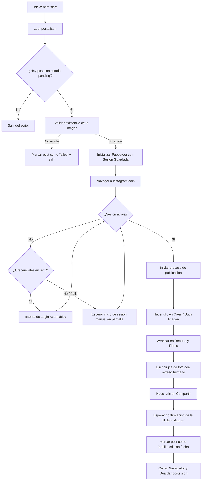

# Publicador Automático de Instagram con Puppeteer

Este sistema es un bot automatizado desarrollado en **Node.js** y **Puppeteer** diseñado para publicar imágenes de forma programada en Instagram, evitando la detección de bots y permitiendo una automatización completa o parcial del flujo de trabajo.

---

## 📋 Tabla de Contenidos
1. [Características Principales](#-características-principales)
2. [Estructura del Proyecto](#-estructura-del-proyecto)
3. [Flujo de Funcionamiento](#-flujo-de-funcionamiento)
4. [Instalación y Configuración](#%EF%B8%8F-instalación-y-configuración)
5. [Guía de Uso Paso a Paso](#-guía-de-uso-paso-a-paso)
6. [Automatización con el Programador de Tareas](#-automatización-con-el-programador-de-tareas)
7. [Solución de Problemas](#%EF%B8%8F-solución-de-problemas)

---

## 🚀 Características Principales

- **Evasión de Bloqueos:** Utiliza `puppeteer-extra` junto con `puppeteer-extra-plugin-stealth` para simular un comportamiento de navegación real y evitar la detección por parte de los sistemas de seguridad de Instagram.
- **Persistencia de Sesión:** Guarda las cookies y el almacenamiento local de la sesión en el directorio local `./session`, eliminando la necesidad de iniciar sesión en cada ejecución.
- **Cola de Publicaciones Inteligente:** Administrada a través de un archivo `posts.json` simple. Registra automáticamente el estado de cada post (`pending`, `published`, `failed`), la fecha de publicación y los mensajes de error en caso de fallo.
- **Escritura Humana:** Simula la pulsación de teclas con retrasos aleatorios al escribir los pies de foto para imitar la actividad humana.
- **Modo Invisible (Headless):** Se puede ejecutar en segundo plano (`HEADLESS=true`) una vez que la sesión inicial ha sido configurada.

---

## 📁 Estructura del Proyecto

```text
Puppeteer/
├── queue/               # Carpeta donde se colocan las imágenes a publicar (.jpg, .png)
├── session/             # Datos de sesión de Chrome (cookies, caché, etc.) [Auto-generado]
├── src/
│   ├── browser.js       # Inicialización y configuración de Puppeteer Extra (modo stealth)
│   ├── index.js         # Lógica de orquestación de la cola y flujo principal
│   ├── login.js         # Script específico para forzar e inicializar la sesión manual
│   └── publisher.js     # Interacción directa con la UI de Instagram (login, navegación, subida)
├── .env                 # Variables de entorno y configuración del bot
├── package.json         # Dependencias del proyecto y scripts
├── posts.json           # Base de datos de la cola de publicaciones (JSON)
└── README.md            # Documentación del sistema (este archivo)
```

---

## ⚙️ Flujo de Funcionamiento

El siguiente diagrama detalla cómo procesa el bot cada ejecución:



---

## 🛠️ Instalación y Configuración

### Prerrequisitos
- Tener instalado **Node.js** (versión 16 o superior recomendada).
- Una cuenta de Instagram activa.

### Configuración del archivo `.env`
Crea o edita el archivo `.env` en la raíz del proyecto con los siguientes parámetros:

```env
# Configuración del Navegador
HEADLESS=false
USER_DATA_DIR=./session

# Opcional: Credenciales para Login Automático
INSTAGRAM_USERNAME=tu_usuario_de_instagram
INSTAGRAM_PASSWORD=tu_contraseña_de_instagram
```

> [!TIP]
> Mantener `HEADLESS=false` durante la primera configuración es crucial para verificar visualmente que todo funcione y resolver cualquier desafío (como el código 2FA).

---

## 📖 Guía de Uso Paso a Paso

### Paso 1: Inicio de Sesión Inicial (Obligatorio)
Debido a las medidas de seguridad de Instagram, se requiere realizar un inicio de sesión inicial para guardar la sesión en el equipo.

1. Abre tu terminal (PowerShell o CMD) y ve al directorio del proyecto.
2. Ejecuta el inicializador de sesión:
   ```bash
   npm run login
   ```
3. Se abrirá una ventana del navegador de Chrome. **Inicia sesión manualmente** en Instagram. Si tienes autenticación de dos factores (2FA), introduce el código correspondiente.
4. Una vez cargado el feed principal de Instagram, el script detectará la sesión, guardará las cookies en la carpeta `/session` y cerrará la ventana de forma automática.

---

### Paso 2: Configurar tu Cola de Publicaciones
1. Guarda las imágenes que deseas publicar en la carpeta `queue/`.
2. Abre o crea el archivo `posts.json` en la raíz del proyecto y estructura tus publicaciones de la siguiente manera:

```json
[
  {
    "id": 1,
    "imagePath": "queue/mi-foto-1.jpg",
    "caption": "¡Este es el pie de foto de mi primer post automatizado! 🚀 #marketing #bot",
    "status": "pending",
    "publishedAt": null
  },
  {
    "id": 2,
    "imagePath": "queue/mi-foto-2.jpg",
    "caption": "Aquí va el texto de la segunda publicación. 😊 #instagram",
    "status": "pending",
    "publishedAt": null
  }
]
```

*Campos clave:*
- `imagePath`: Ruta relativa o absoluta de la imagen.
- `status`: Debe ser `"pending"` para que el bot la procese. Cambiará automáticamente a `"published"` o `"failed"` tras el intento.

---

### Paso 3: Probar la Publicación
Para probar la subida de la primera imagen pendiente:

```bash
npm start
```

El navegador se abrirá en modo visible, realizará la navegación, subirá la imagen, escribirá el pie de foto y hará clic en compartir. Tras confirmar la publicación, se cerrará y actualizará el archivo `posts.json`.

> [!NOTE]
> Una vez comprobado que el sistema funciona correctamente, puedes cambiar en el `.env` la propiedad `HEADLESS=true` para que las futuras publicaciones se realicen de forma silenciosa en segundo plano.

---

## ⏰ Automatización con el Programador de Tareas

Para programar publicaciones automáticas sin necesidad de ejecutar comandos manualmente:

1. Abre el **Programador de tareas** en Windows.
2. Haz clic en **Crear tarea básica...** en el panel lateral derecho.
3. Asigna un nombre a la tarea (ej: `Instagram Publicador Mañana`).
4. Selecciona la frecuencia deseada (por ejemplo, **Diariamente**) e introduce la hora de ejecución.
5. En acción, selecciona **Iniciar un programa**.
6. Rellena los campos con la siguiente información:
   - **Programa o script**: `node` (o la ruta completa a Node, ej: `C:\Program Files\nodejs\node.exe` si no está en el PATH).
   - **Agregar argumentos**: `src/index.js`
   - **Iniciar en**: La ruta raíz del proyecto (ej: `X:\Sistemas\Puppeteer`). Esto es **indispensable** para que resuelva correctamente los paths relativos.
7. Haz clic en **Finalizar**. Puedes repetir el proceso para programar una publicación en la tarde o noche.

---

## 🛠️ Solución de Problemas

### 1. El bot no avanza del Login
- Asegúrate de que las credenciales en el archivo `.env` son correctas o realiza el proceso `npm run login` de nuevo para regenerar las cookies.
- Si Instagram te pide una verificación de seguridad adicional, ejecuta `npm run login` para resolverla de forma manual.

### 2. No se encuentra el botón "Siguiente" o "Crear"
- Instagram actualiza periódicamente la estructura de su sitio web. Los selectores CSS y XPath están definidos en [publisher.js](file:///x:/Sistemas/Puppeteer/src/publisher.js). Si fallan, es probable que se necesite inspeccionar el sitio web de Instagram y actualizar la lista de selectores en la función `publishPost`.

### 3. Las imágenes no se suben
- Verifica que el formato sea `.jpg` o `.png` y que la ruta especificada en `posts.json` sea la correcta.
- Recuerda que la ruta se evalúa de manera relativa a la raíz del proyecto.
